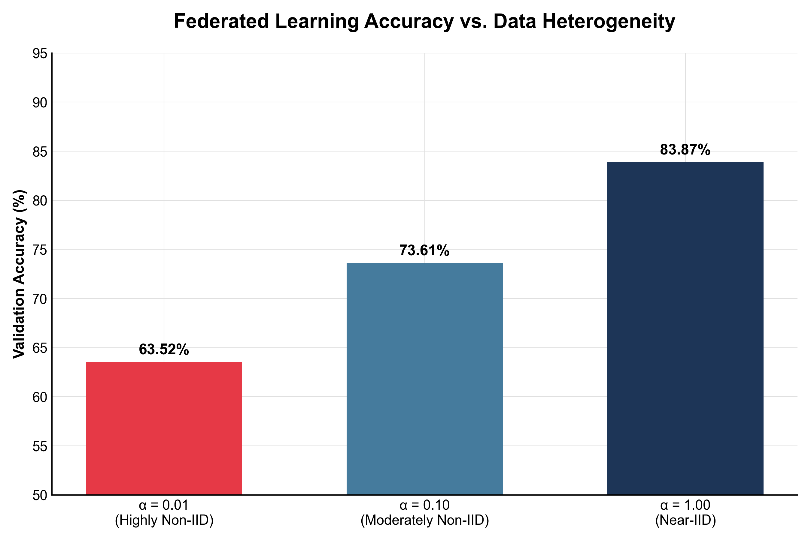

# Multi-Modal Federated Learning on PAD-UFES-20

An AI-assisted implementation exploring multimodal federated learning for skin lesion classification on the [PAD-UFES-20](https://data.mendeley.com/datasets/zr7vgbcyr2/1) dataset. The architecture and training protocol are designed to verify the core ideas proposed in **MERGE: A Model for Multi-Input Biomedical Federated Learning** ([Casella et al., 2023](https://arxiv.org/abs/2309.06217)) — specifically, the fusion of dermoscopic images with structured clinical metadata across heterogeneous federated clients.

Training is orchestrated with [Flower](https://flower.ai/) across 5 clients under varying degrees of data heterogeneity (controlled by the Dirichlet α parameter).

---

## Use Cases & Clinical Relevance

Medical datasets are inherently siloed due to strict privacy regulations (e.g., HIPAA, GDPR) that prevent hospitals from pooling patient records. This poses a significant challenge for training robust deep learning models, which require massive, diverse datasets to generalize well.

This project demonstrates a practical solution for **Dermatology and Oncology**:
1. **Privacy-Preserving Collaboration:** Multiple clinics or hospitals can collaboratively train a shared skin lesion classifier without ever exchanging raw patient images or clinical records. Only model weight updates are transmitted to the central server.
2. **Multi-Modal Diagnostics:** Real-world dermatologists don't just look at an image; they consider the patient's age, gender, medical history, and lesion location. This architecture mimics that clinical workflow by fusing visual features (dermoscopy) with structured tabular data (patient metadata), leading to higher accuracy than image-only models.
3. **Handling Clinical Heterogeneity (Non-IID Data):** Different clinics see different demographic distributions and specialize in different conditions. We use Dirichlet distributions to simulate this real-world label skew and prove the model can converge effectively under extreme data heterogeneity.

---

## Technical Highlights

- **Multi-Modal Late Fusion:** Combines a CNN backbone (ResNet-18) for image processing with an MLP for tabular feature encoding, fusing their embeddings before the final classification head.
- **Federated Orchestration:** Built on [Flower (flwr)](https://flower.ai/), featuring a custom `EarlyStoppingFedAvg` strategy that dynamically manages the global learning rate, tracks the best-performing model, and triggers early stopping.
- **Server-Side Evaluation:** Validates the aggregated model centrally against a held-out, stratified 15% validation split, avoiding the noise of client-side local evaluation.
- **Containerized FL Simulation:** Uses Docker Compose and a shared file-based semaphore to orchestrate 1 server and 5 client containers on a single host, throttling concurrent GPU usage to prevent OOM errors.

---

## Architecture

```
image   (B, 3, 224, 224)  →  VisionBranch  (ResNet-18, pretrained)  →  (B, 512) ─┐
                                                                                   ├→  concat (B, 576)  →  ClassificationHead  →  logits (B, 6)
tabular (B, 61)            →  TabularBranch (2-layer MLP + BN)        →  (B,  64) ─┘
```

| Component | Details |
|---|---|
| Vision branch | ResNet-18 (ImageNet pretrained), FC head replaced with `nn.Identity` |
| Tabular branch | Linear → BN → ReLU → Dropout → Linear → BN → ReLU |
| Fusion | Concatenation along feature dim (512 + 64 = 576) |
| Head | Dropout → Linear(576, 6) |
| Classes | ACK, BCC, MEL, NEV, SCC, SEK (6 skin conditions) |

---

## Federated Setup

- **5 clients**, each training on a non-IID local partition
- **Server-managed LR**: broadcast to all clients each round (no client-side scheduler)
- **Centralized evaluation**: server holds a stratified 15% val set; clients use 100% of their partition for training
- **Early stopping + LR reduction**: LR ÷ 10 after `lr_reduce_after` stale rounds; best checkpoint restored before resuming
- **GPU throttling**: file-based semaphore limits concurrent GPU use across containers (≤ 3 at once)
- **Data partitioning**: Dirichlet distribution via `flwr-datasets` — `alpha` controls heterogeneity

---

## Results

Validation accuracy on the 15% server-held stratified split (5 clients, seed=42, SGD lr=0.01):

<picture>
  <source media="(prefers-color-scheme: dark)" srcset="accuracy_vs_alpha_dark.png">
  <source media="(prefers-color-scheme: light)" srcset="accuracy_vs_alpha_light.png">
  
</picture>

| Dirichlet Alpha (α) | Val Accuracy | Data Distribution |
| :--- | :--- | :--- |
| **0.01** | 63.52% | Highly non-IID — each client sees mostly 1–2 classes |
| **0.10** | 73.61% | Moderately non-IID |
| **1.00** | 83.87% | Near-IID — roughly uniform class distribution per client |

*Note: Higher α → more uniform class distribution across clients → higher accuracy. Lower α simulates the realistic scenario where each hospital/clinic specialises in certain conditions.*

---

## Project Structure

```
multi-modal-fl/
├── dataset.py          # PAD-UFES-20 dataset class, tabular encoding, train/val split
├── partitioning.py     # Dirichlet partitioning via Flower/HuggingFace
├── model.py            # VisionBranch, TabularBranch, MultiModalClassifier
├── client.py           # Flower NumPyClient, GPU slot semaphore
├── server.py           # EarlyStoppingFedAvg strategy, centralized evaluation
├── Dockerfile          # Single image for server + all clients
├── docker-compose.yml  # 1 server + 5 client services
├── requirements.txt
├── archive/            # PAD-UFES-20 data (not committed — mount as volume)
│   ├── metadata.csv
│   ├── imgs_part_1/
│   ├── imgs_part_2/
│   └── imgs_part_3/
└── checkpoints/        # Best model weights saved here (.npz)
```

---

## Setup

### Prerequisites
- Docker + Docker Compose
- NVIDIA GPU + [NVIDIA Container Toolkit](https://docs.nvidia.com/datacenter/cloud-native/container-toolkit/install-guide.html)
- PAD-UFES-20 dataset placed in `./archive/`

### Dataset

Download from [Mendeley Data](https://data.mendeley.com/datasets/zr7vgbcyr2/1) and arrange as:

```
archive/
├── metadata.csv
├── imgs_part_1/imgs_part_1/
├── imgs_part_2/imgs_part_2/
└── imgs_part_3/imgs_part_3/
```

---

## Running

### Docker (recommended)

```bash
# Build and start all containers (1 server + 5 clients)
docker compose up --build

# To run with a specific alpha (edit docker-compose.yml or pass via override)
docker compose up --build -e ALPHA=1.0
```

The server runs centralized evaluation each round and saves the best checkpoint to `./checkpoints/best_model.npz`.

### Local (no Docker)

```bash
pip install -r requirements.txt

# Terminal 1 — start the server
python server.py \
  --data-root ./archive \
  --rounds 300 \
  --patience 30 \
  --checkpoint checkpoints/best_model.npz \
  --device cuda

# Terminals 2–6 — start each client (separate terminal per client)
python client.py --client-id 0 --archive ./archive --alpha 1.0
python client.py --client-id 1 --archive ./archive --alpha 1.0
python client.py --client-id 2 --archive ./archive --alpha 1.0
python client.py --client-id 3 --archive ./archive --alpha 1.0
python client.py --client-id 4 --archive ./archive --alpha 1.0
```

### Smoke tests

```bash
python dataset.py       # verifies dataset loading and feature encoding
python model.py         # verifies forward pass shape
python partitioning.py  # verifies Dirichlet partition with no val leakage
```

---

## Key Design Decisions

**No client-side val split** — Each client's full Dirichlet partition is used for training. Evaluation is done centrally on the server using its 15% stratified hold-out, which is never seen by any client.

**Reproducible splits** — The `--seed` flag must match between the server and all clients. The same seed produces the same 85/15 stratified split and the same Dirichlet partition on every machine.

**Scaler fitted on train rows only** — `numerical_stats` (mean/std for age, diameter_1, diameter_2) are computed on train rows and shared with all clients to prevent val leakage.

**Offline-friendly** — ResNet-18 weights are baked into the Docker image at build time. HuggingFace datasets are used in offline mode only (`HF_DATASETS_OFFLINE=1`).

---

## Dependencies

| Package | Purpose |
|---|---|
| `torch` / `torchvision` | Model, transforms, ResNet-18 weights |
| `flwr` | Federated learning server + client framework |
| `flwr-datasets` | `DirichletPartitioner` |
| `datasets` | HuggingFace in-memory bridge (used by flwr-datasets) |
| `pandas` | CSV loading and tabular encoding |
| `filelock` | Cross-process GPU slot semaphore |

---

## License

This project is released under the MIT License.
The PAD-UFES-20 dataset is subject to its own [license](https://data.mendeley.com/datasets/zr7vgbcyr2/1).
